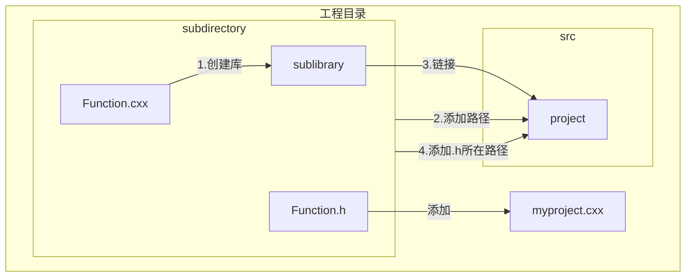

# VScode+Cmake使用学习

## 软件安装和环境配置

### 1.通过msys安装MinGW

 1. 打开msys终端

     1. 如果没有Msys2：[官网连接](https://www.msys2.org/)。
     2. 正常安装完成之后，打开开始菜单，搜索“mys”，打开msys终端。

 2. 安装MinGW：

    ```shell
    #终端中输入命令
    pacman -S mingw-w64-x86_64-gcc pkg-config	#安装gcc软件包
    ```

    - pacman是arclinux中的软件管理工具，也是widows上msys2默认的软件管理工具。pacman可以直接从网络上的软件仓库下载安装及删除软件，自动处理依赖关系，类似Ubuntu中的apt-get。
    - pacman常用命令语法见链接[msys2软件包管理工具pacman常用命令_pacman -s mingw-CSDN博客](https://blog.csdn.net/hustlei/article/details/86687621)

 3. 安装make组件和cmake组件

    ```shell
    pacman -S mingw-w64-x86_64-make
    pacman -S  mingw-w64-x86_64-cmake
    ```

### 2.直接安装MingGW lite

1. 安装包网址：[Download MinGW](https://sourceforge.net/projects/mingw/files/latest/download)
2. 运行程序，选中基础包和gcc g++套件，点击下载即可。

### 3. 下载Cmake软件

1. 官网链接：[CMake - Upgrade Your Software Build System](https://cmake.org/)
2. 运行程序安装即可。

### 4. 添加环境变量

1. 将 [磁盘位置]:\msys64\mingw[32或64]\bin 目录，加入到用户环境变量。
   - 用户环境变量和系统环境变量其实是一样的，只是系统环境变量更像是全局变量，而用户环境变量更像是私人的。
2. 将 [磁盘位置]:\Program Files\CMake\bin 目录，加入到用户环境变量。
   - 如果Program Files通常安装的是64位应用，而Program Files（x86）通常安装的是32位的。
3. 修改minGW bin目录下的mingw32-make.exe为**make.exe**
   - 这一步可以让你在后来的命令行操作中，不用使用完整的mingw32_make.exe，而是单纯的使用make执行编译命令。

### 5. 设置VScode

1. 安装所需的插件:直接安装C++和Cmake拓展包即可。

2. 在vscode中配置cmake，可能报错：
   CMake: 无法确定要使用的 CMake 生成器。请安装或配置首选生成器，或更新 settings.json、工具包配置或路径变量。 Error: 找不到任何可用的生成器。
   解决方法：
   在.vscode中新建setting.json，或者Ctrl+Shift+P打开工作区setting.json（用户级别的）。
   如果想使用的构建工具是MakeFile， 则在settings.json文件的末尾添加：

```javascript
"cmake.generator": "MinGW Makefiles"	// 不添加也行，使用Poweshell+Cmake或Cmake GUI也可解决，后面有讲解
```

## 构建项目(将采用分析案例来进行)

### 1. 单文件构建

1. 假设现在有一个工程cmake-3.30.1-tutorial-source\Step1:

```shell
Step1：
    CMakeLists.txt
    tutorial.cxx
    TutorialConfig.h.in
```

2. 编写MakeLists.txt文件：

```makefile
cmake_minimum_required(VERSION 3.10)	# 指定最小的Cmake版本，确保工程编译的兼容性
project(Tutorial VERSION 1.0) # 给工程命名；当为工程附上版本号时，1会幅值给<PROJECT-NAME>_VERSION_MAJOR，0会幅值给<PROJECT-NAME>_VERSION_MINOR

set(CMAKE_CXX_STANDARD 11) # 指定C++的版本
set(CMAKE_CXX_STANDARD_REQUIRED True) # 置使用以上版本为True

configure_file(TutorialConfig.h.in TutorialConfig.h) # 将文件复制到另一个位置并修改其内容

add_executable(Tutorial tutorial.cxx)	# 生成可执行文件，这里程序名即为功能名
target_include_directories(Tutorial PUBLIC "${PROJECT_BINARY_DIR}") # 该命令可以指定目标（exe或者so文件）需要包含的头文件路径。在此处${PROJECT_BINARY_DIR}是指build路径，因为我们上面的TutorialConfig.h生成在build路径下
```

3. build  & run:

   1. 使用VScode自带的Cmake工具进行构建编译：
      1. 先配置 >cmakeconfigure，使用该方法工具会直接在工作空间的目录下构建一个build目录，build目录里包含已经编译好的Makefile文件，也因此可以直接生成可执行文件：
      2. 进入build目录，并编译：

   ```shell
   # 当前目录为工作空间
   cd build
   cmake --build .		# 生成可执行文件
   make	# 如果不是第一次编译，可以直接使用make生成可执行文件
   ```

   2. 使用Cake进行编译：

      1. 打开Powershell，输入命令行：

      ```shell
      # 当前目录为工作空间
      mkdir build		# 创建build文件夹
      cd build	# 进入build文件夹
      cmake ../Step1 -G "Unix Makefiles"		# 选择需要编译文件目录
      cmake --build .		# 生成可执行文件
      make	# 如果不是第一次编译，可以直接使用make生成可执行文件
      ```
      
      2. 编译逻辑：创建存放编译文件的文件夹-->在文件夹中执行cmake命令(指定要参照的CmakeLists所在的文件夹)用于创建makefile-->执行编译，该编译创建的是对应文件夹可执行程序的执行文件
      
      3. 编译问题表：[用CMake构建工程时 cmake -G“Unix Makefiles“ 的使用_cmake -g "unix makefiles-CSDN博客](https://blog.csdn.net/yangjia_cheng/article/details/111408753)
      
         如 
      
         ```java
         cmake ../Step1 -G "Unix Makefiles"
         ```
      
         则为正确

### 2. 个人库的构建

1. 构建过程：



